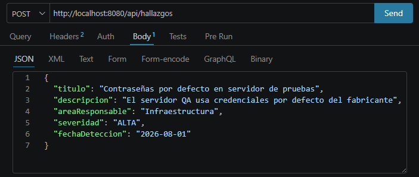
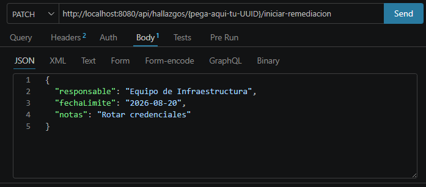
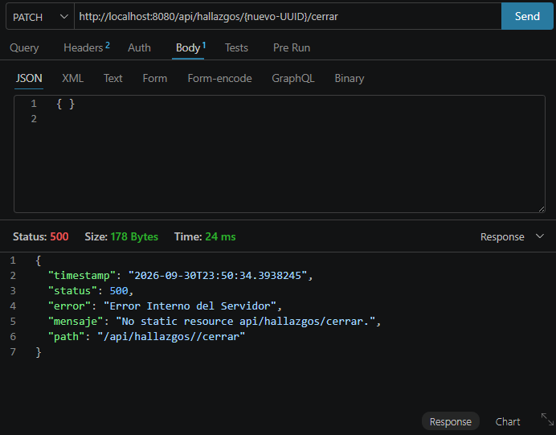
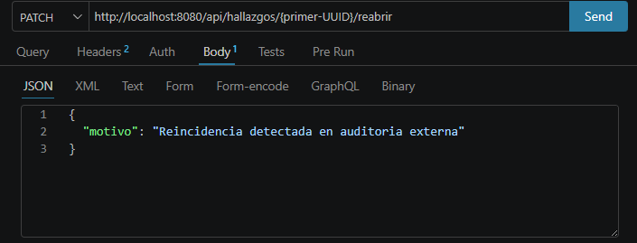

# Laboratorio Unidad 8: Patrones Arquitectónicos II
## Clean Architecture, CQRS Liviano y Bitácora Append-Only (Audit Trail)

**Estudiante:** Jesus Perez  
**Institución:** Universidad de Santander (UDES)  
**Materia:** Arquitectura de Software  
**Repositorio GitHub:** [https://github.com/Yizuz13/perez-post1-u8.git](https://github.com/Yizuz13/perez-post1-u8.git)  
**Tecnologías:** Java 17, Spring Boot 3.2.5, Spring Data JPA, H2 Database (In-Memory), Bean Validation, JUnit 5, Mockito.

---

## 1. Introducción y Contexto del Dominio

El presente proyecto implementa un sistema para la gestión y seguimiento del ciclo de vida de **Hallazgos de Auditoría** en organizaciones empresariales. La solución ha sido diseñada bajo los principios más estrictos de **Clean Architecture (Arquitectura Limpia)** propuesta por Robert C. Martin ("Uncle Bob"), complementada con una variante arquitectónica de **CQRS Liviano** y un patrón de **Bitácora Inmutable Append-Only** para auditoría y trazabilidad.

El agregado principal modela el ciclo de vida de los hallazgos mediante una **Máquina de Estados Finita**, asegurando la invariabilidad del dominio y protegiendo las reglas de negocio de cualquier dependencia tecnológica o de infraestructura.

---

## 2. Los 4 Círculos Concéntricos de Clean Architecture

Clean Architecture organiza el software en capas concéntricas gobernadas por la **Regla de Dependencia (Dependency Rule)**: *las dependencias del código fuente únicamente pueden apuntar hacia adentro, hacia las políticas de más alto nivel*.

```
   +-------------------------------------------------------------+
   |                  4. Frameworks & Drivers                    |
   |   (Spring Boot, H2 Database, Tomcat, application.properties)|
   |   +-----------------------------------------------------+   |
   |   |             3. Interface Adapters                   |   |
   |   |   (Controllers REST, DTOs, JPA Entities, Mappers)   |   |
   |   |   +---------------------------------------------+   |   |
   |   |   |              2. Use Cases                   |   |   |
   |   |   |   (Application Business Rules & Ports)      |   |   |
   |   |   |   +-------------------------------------+   |   |   |
   |   |   |   |            1. Entities              |   |   |   |
   |   |   |   |      (Domain Business Rules)        |   |   |   |
   |   |   |   +-------------------------------------+   |   |   |
   |   |   +---------------------------------------------+   |   |
   +---+-----------------------------------------------------+---+
```

### 1. Entidades (Domain - Enterprise Business Rules)
- **Ubicación:** `com.example.auditoria.domain`
- **Componentes:**
  - `HallazgoAuditoria`: Agregado Raíz (*Aggregate Root*) que encapsula las invariantes de negocio. **No expone setters públicos**; cualquier modificación de estado se ejecuta mediante métodos de intención del negocio (`iniciarRemediacion`, `cerrar`, `reabrir`).
  - `HallazgoId`: *Value Object* inmutable (Java Record) fuertemente tipado basado en `UUID`.
  - `Severidad`: Enumeración simple (`CRITICA`, `ALTA`, `MEDIA`, `BAJA`) para clasificación taxonómica de riesgo.
  - `EstadoHallazgo`: Enumeración que implementa formalmente la **Máquina de Estados Finita**:
    $$\text{ABIERTO} \longrightarrow \text{EN\_REMEDIACION} \longrightarrow \text{CERRADO} \longrightarrow \text{REABIERTO} \longrightarrow \text{EN\_REMEDIACION}$$
  - `PlanRemediacion`: *Value Object* inmutable (Java Record) que contiene la acción correctiva, el responsable y la fecha de compromiso.
  - Excepciones de dominio: `TransicionInvalidaException` y `HallazgoNotFoundException`.
- **Regla Estricta:** Cero dependencias externas. **PROHIBIDO** el uso de importaciones provenientes de `org.springframework.*` o `jakarta.persistence.*`.

### 2. Casos de Uso (Usecase - Application Business Rules)
- **Ubicación:** `com.example.auditoria.usecase`
- **Interfaces de Casos de Uso (Puertos de Entrada):**
  - `RegistrarHallazgoUseCase`: Registro inicial en estado `ABIERTO`.
  - `IniciarRemediacionUseCase`: Asignación del plan de mitigación y transición a `EN_REMEDIACION`.
  - `CerrarHallazgoUseCase`: Cierre formal con validación de fecha y motivo hacia `CERRADO`.
  - `ReabrirHallazgoUseCase`: Reactivación por ineficacia o recurrencia hacia `REABIERTO`.
  - `ConsultarHallazgoUseCase`: Búsqueda por ID y listado de hallazgos.
  - `ObtenerDashboardAuditoriaUseCase`: Consulta de métricas agregadas.
  - `ConsultarHistorialUseCase`: Consulta de la bitácora inmutable.
- **Puertos de Salida (Ports):**
  - `HallazgoRepositoryPort`: Abstracción agnóstica para la persistencia y lectura de hallazgos y métricas.
  - `HistorialAuditoriaPort`: Abstracción para el registro append-only de eventos de auditoría.
  - Vistas y proyecciones de puerto: `ConteoCategoria`, `PromedioCategoria`, `DashboardAuditoriaView`, `CambioEstadoView`.
- **Implementaciones:** `com.example.auditoria.usecase.impl`
- **Regla Estricta:** Clases Java puras POJO. **PROHIBIDO** el uso de anotaciones de Spring (`@Component`, `@Service`, `@Autowired`) para mantener la pureza de la aplicación.

### 3. Adaptadores de Interfaz (Interface Adapters)
- **Ubicación:** `com.example.auditoria.adapter`
- **Adaptadores de Entrada (Inbound / Web):**
  - `HallazgoController`: Controlador REST (`/api/hallazgos`) que procesa solicitudes HTTP, delega a los casos de uso y retorna DTOs.
  - DTOs de solicitud y respuesta: `RegistrarHallazgoRequest`, `IniciarRemediacionRequest`, `CerrarRequest`, `ReabrirRequest`, `HallazgoResponse`, `DashboardResponse`, `CambioEstadoResponse`.
  - `GlobalExceptionHandler`: Captura excepciones y las traduce a códigos HTTP semánticos (p. ej., `TransicionInvalidaException` $\to$ **400 Bad Request**, `HallazgoNotFoundException` $\to$ **404 Not Found**).
- **Adaptadores de Salida (Outbound / Persistence):**
  - `HallazgoJpaEntity`: Entidad relacional mapeada con JPA/Hibernate para la tabla `hallazgos`.
  - `HallazgoJpaRepository`: Repositorio Spring Data JPA con soporte para proyecciones nativas (`COUNT`, `AVG(DATEDIFF)`).
  - `HallazgoRepositoryAdapter`: Implementación del puerto `HallazgoRepositoryPort`.
  - `HistorialCambioEstadoJpaEntity`: Entidad relacional **append-only** para la tabla `historial_cambios_estado`.
  - `HistorialCambioEstadoJpaRepository`: Repositorio de persistencia del historial.
  - `HistorialAuditoriaAdapter`: Implementación del puerto `HistorialAuditoriaPort`.

### 4. Frameworks y Drivers
- **Ubicación:** `com.example.auditoria.config`, `pom.xml`, `application.properties`
- **Componentes:**
  - `AuditoriaConfiguration`: Clase `@Configuration` de Spring que registra explícitamente cada caso de uso como `@Bean`, inyectando los adaptadores correspondientes.
  - Servidor web embebido Tomcat, Base de datos en memoria H2 con dialecto nativo y consola web habilitada en `/h2-console`.

---

## 3. Diagrama de la Arquitectura

```mermaid
classDiagram
    direction TB

    package "1. DOMAIN (Core Puro)" {
        class HallazgoAuditoria {
            -HallazgoId id
            -String titulo
            -String descripcion
            -String categoria
            -Severidad severidad
            -EstadoHallazgo estado
            -PlanRemediacion planRemediacion
            -LocalDate fechaDeteccion
            -LocalDate fechaCierre
            +iniciarRemediacion(PlanRemediacion)
            +cerrar(String, LocalDate)
            +reabrir(String)
        }
        class EstadoHallazgo {
            <<enumeration>>
            ABIERTO
            EN_REMEDIACION
            CERRADO
            REABIERTO
            +puedeTransicionarA(EstadoHallazgo)
            +validarTransicion(EstadoHallazgo)
        }
        class PlanRemediacion {
            <<record>>
            +String descripcionAccion
            +String responsable
            +LocalDate fechaCompromiso
        }
        class HallazgoId {
            <<record>>
            +UUID valor
        }
    }

    package "2. USE CASE (Aplicación Pura)" {
        class RegistrarHallazgoUseCase {
            <<interface>>
            +registrar(...)
        }
        class IniciarRemediacionUseCase {
            <<interface>>
            +iniciarRemediacion(...)
        }
        class CerrarHallazgoUseCase {
            <<interface>>
            +cerrar(...)
        }
        class ReabrirHallazgoUseCase {
            <<interface>>
            +reabrir(...)
        }
        class HallazgoRepositoryPort {
            <<interface>>
            +guardar(HallazgoAuditoria)
            +buscarPorId(HallazgoId)
            +obtenerDashboard()
        }
        class HistorialAuditoriaPort {
            <<interface>>
            +registrarCambio(...)
            +consultarHistorialPorHallazgo(...)
        }
    }

    package "3. ADAPTERS (Infraestructura Web & Persistencia)" {
        class HallazgoController {
            +POST /api/hallazgos
            +POST /api/hallazgos/{id}/iniciar-remediacion
            +POST /api/hallazgos/{id}/cerrar
            +POST /api/hallazgos/{id}/reabrir
            +GET /api/hallazgos/dashboard
            +GET /api/hallazgos/{id}/historial
        }
        class HallazgoRepositoryAdapter {
            +guardar(HallazgoAuditoria)
            +obtenerDashboard()
        }
        class HistorialAuditoriaAdapter {
            +registrarCambio(...)
            +consultarHistorialPorHallazgo(...)
        }
        class HallazgoJpaEntity
        class HistorialCambioEstadoJpaEntity
    }

    HallazgoAuditoria --> EstadoHallazgo
    HallazgoAuditoria --> PlanRemediacion
    HallazgoAuditoria --> HallazgoId

    RegistrarHallazgoUseCase ..> HallazgoAuditoria
    IniciarRemediacionUseCase ..> HallazgoAuditoria
    CerrarHallazgoUseCase ..> HallazgoAuditoria
    ReabrirHallazgoUseCase ..> HallazgoAuditoria

    HallazgoController --> RegistrarHallazgoUseCase
    HallazgoController --> IniciarRemediacionUseCase
    HallazgoController --> CerrarHallazgoUseCase
    HallazgoController --> ReabrirHallazgoUseCase

    HallazgoRepositoryAdapter ..|> HallazgoRepositoryPort
    HistorialAuditoriaAdapter ..|> HistorialAuditoriaPort
    HallazgoRepositoryAdapter --> HallazgoJpaEntity
    HistorialAuditoriaAdapter --> HistorialCambioEstadoJpaEntity
```

---

## 4. Análisis Costo-Beneficio y Justificación Técnica (Paso 8)

Para el sistema de auditoría se evaluó la implementación de un **CQRS Completo con Event Sourcing** frente a una **Solución Liviana (CQRS Liviano sobre el mismo repositorio relacional + Bitácora Append-Only)**. Con base en los criterios de la Sección 7 de la guía académica, se optó por la solución liviana.

### Tabla Comparativa de Evaluación

| Criterio | CQRS Completo + Event Sourcing | Decisión Implementada: CQRS Liviano + Bitácora Append-Only |
| :--- | :--- | :--- |
| **Bases de Datos** | Doble almacén: Event Store (Write) + BD de Lectura (Read Model). | **Un único motor relacional (H2 / PostgreSQL)** con tablas separadas (`hallazgos` e `historial_cambios_estado`). |
| **Consistencia** | Eventual (*Eventual Consistency*), con desfase temporal (*lag*). | **Inmediata (ACID / Transaccional)** en la misma unidad de trabajo. |
| **Sincronización** | Asíncrona mediante broker de mensajería (Kafka/RabbitMQ) y Event Handlers. | Sincrónica en el adaptador de persistencia dentro de `@Transactional`. |
| **Trazabilidad** | Replay de flujo de eventos para reconstruir el estado de la entidad. | **Bitácora histórica relacional inmutable (Audit Trail)** de inserción exclusiva. |
| **Complejidad Operativa**| Muy alta: versionado de esquemas de eventos, snapshots, idempotencia. | **Baja y mantenible:** consultas relacionales directas, vistas e índices estándar. |
| **Sobrecarga de Infraestructura** | Múltiples servicios, clúster de mensajería, consumidores de eventos. | Cero infraestructura adicional: corre dentro de la misma aplicación Spring Boot. |

---

### Respuestas a las 5 Preguntas del Análisis Costo-Beneficio

#### 1. Escala y Carga
* **Contexto:** El sistema de auditoría está concebido para un entorno académico, mono-usuario o departamental, con un volumen estimado de decenas o centenas de hallazgos por período de control.
* **Evaluación:** CQRS completo y Event Sourcing fueron diseñados para sistemas de ultra-alta concurrencia (como comercio electrónico global o procesamiento financiero de millones de transacciones por segundo), donde la tasa de lectura supera en órdenes de magnitud a la escritura ($1000:1$).
* **Conclusión:** Para la escala de este sistema, introducir particionamiento de bases de datos, buses de mensajería distribuidos y proyecciones asíncronas añadiría latencia de red innecesaria y desperdicio de recursos computacionales sin beneficio medible en rendimiento.

#### 2. Complejidad de las Consultas
* **Contexto:** Las necesidades de reporte de auditoría exigen métricas agregadas: conteo de hallazgos agrupados por categoría y el promedio de días requeridos para resolver hallazgos cerrados.
* **Evaluación:** Con una base de datos relacional y Spring Data JPA, estas métricas se resuelven de forma óptima y declarativa mediante sentencias SQL con `GROUP BY`, `COUNT` y funciones de fecha como `AVG(DATEDIFF('DAY', fecha_deteccion, fecha_cierre))`.
* **Conclusión:** Replicar datos hacia una base de datos de lectura no relacional (como Elasticsearch o MongoDB) implicaría programar proyectores asíncronos, gestionar fallos de serialización y resolver inconsistencias entre modelos, cuando una simple proyección relacional ejecuta la consulta en submilisegundos sobre índices estándar.

#### 3. Consistencia de la Información
* **Contexto:** En el dominio de la auditoría y control interno, la integridad y fidelidad de los datos es crítica. Un auditor que aprueba un plan de remediación o cierra una no conformidad legal debe visualizar inmediatamente el impacto en el estado y en los indicadores del dashboard.
* **Evaluación:** En un esquema de CQRS completo con consistencia eventual, existe una ventana de sincronización (*event lag*) durante la cual la base de datos de consulta aún no refleja la escritura recién confirmada. Esto genera confusión ("phantom reads"), duplicación de esfuerzos o sospecha de fallos en el sistema.
* **Conclusión:** La consistencia inmediata (ACID) provista por transacciones locales en el repositorio relacional garantiza exactitud legal instantánea y confiabilidad operativa para los auditores.

#### 4. Naturaleza de la Trazabilidad Exigida
* **Contexto:** Los marcos de cumplimiento y normativas (ISO 27001, SOC 2, SOX) requieren un **Audit Trail** inmutable que certifique quién modificó un hallazgo, cuándo ocurrió el cambio, el estado previo, el estado resultante y la justificación.
* **Evaluación:** Event Sourcing resuelve esto persistiendo cada cambio como un evento atómico del cual se deriva el estado actual. Sin embargo, requiere implementar lógica de reproducción de eventos (*event replay*), resolución de cambios de esquema de eventos a lo largo de los años (*event versioning / upcasting*) y mecanismos de instantáneas (*snapshots*) para evitar degradación de rendimiento.
* **Conclusión:** Una tabla relacional dedicada **append-only** (`historial_cambios_estado`), en la que únicamente se ejecutan operaciones `INSERT` (sin `UPDATE` ni `DELETE`), satisface plenamente el 100% de los requerimientos de auditoría y certificación forense con una simplicidad técnica inmensamente superior.

#### 5. Señales de Sobre-Ingeniería
* **Contexto:** El proyecto es desarrollado y mantenido por un equipo de 1 desarrollador (Jesus Perez).
* **Evaluación:** Implementar la arquitectura CQRS + Event Sourcing completa exigiría:
  1. Diseñar y configurar infraestructura de mensajería (Kafka, Zookeeper/KRaft, schema registries).
  2. Implementar patrones complejos para transacciones distribuidas (Saga Pattern o Outbox Pattern).
  3. Gestionar la complejidad de depuración distribuida (*distributed tracing*) y eventual desincronización de proyecciones.
* **Conclusión:** La curva de aprendizaje, el tiempo de desarrollo y los costos operativos representarían una clásica manifestación de **sobre-ingeniería accidental**, violando los principios fundamentales de diseño de software (*YAGNI: You Aren't Gonna Need It* y *KISS: Keep It Simple, Stupid*). La solución adoptada es elegante, robusta y perfectamente dimensionada al problema.

---

## 5. Justificación de las 4 Decisiones de Diseño

### Decisión 1: `Severidad` (Enum Simple) vs `EstadoHallazgo` (Enum con Máquina de Estados Finita)
- **Severidad (`CRITICA`, `ALTA`, `MEDIA`, `BAJA`):** Es un atributo cualitativo y taxonómico que mide el impacto o nivel de riesgo técnico. No posee un ciclo de vida propio, no depende del tiempo y no restringe la secuencia de operaciones del sistema; por ende, un Enum plano de Java es la estructura idónea.
- **EstadoHallazgo:** Modela el ciclo de vida secuencial del hallazgo. Cada estado restringe estrictamente a qué estados futuros se puede evolucionar mediante el método abstracto `puedeTransicionarA(EstadoHallazgo destino)` y la validación `validarTransicion(EstadoHallazgo destino)`. Encapsular esta lógica dentro del Enum evita estructuras de control dispersas (`if/switch` anidados) en la capa de aplicación y garantiza que el modelo sea intrínsecamente seguro ante transiciones ilegales.

### Decisión 2: `PlanRemediacion` como Value Object Inmutable Embebido en el Agregado
- `PlanRemediacion` no posee identidad propia ni existe de forma independiente a un hallazgo de auditoría. Carece de sentido de negocio consultar un "plan" sin el contexto del hallazgo al que pertenece.
- Al modelarlo como un **Value Object inmutable (Java Record)** embebido directamente en el agregado `HallazgoAuditoria`:
  1. Se garantiza la **consistencia transaccional inmediata**: el cambio a estado `EN_REMEDIACION` y la asignación del plan ocurren en la misma operación atómica.
  2. Se protegen las invariantes del agregado en memoria antes de persistir.
  3. En la persistencia relacional, sus columnas se integran en la tabla `hallazgos` sin requerir joins adicionales ni foreign keys innecesarias.

### Decisión 3: CQRS Liviano (Consultas Agregadas en Mismo Repositorio) vs CQRS Completo
- Se aplica el principio de segregación de responsabilidades a nivel conceptual: los métodos de escritura (comandos) modifican entidades de dominio a través de casos de uso específicos, mientras que los métodos de lectura (consultas) aprovechan proyecciones optimizadas (`ConteoCategoriaProjection`, `PromedioCategoriaProjection`).
- Ambas responsabilidades operan sobre la misma base de datos relacional y el mismo adaptador. Esto confiere la claridad de diseño de CQRS sin la fragilidad operativa ni la sobrecarga de sincronización asíncrona de un CQRS completo.

### Decisión 4: Bitácora Relacional Append-Only vs Event Store con Event Sourcing
- La entidad `HistorialCambioEstadoJpaEntity` actúa como un registro histórico puro de auditoría. Al registrar cada transición (`ABIERTO -> EN_REMEDIACION`, `EN_REMEDIACION -> CERRADO`, etc.), se almacena una tupla con ID, identificador del hallazgo, estado previo, estado nuevo, usuario responsable, observación y marca de tiempo (`LocalDateTime.now()`).
- Al no exponerse endpoints ni métodos para modificar o eliminar registros de esta tabla, se preserva la inmutabilidad física y lógica del historial. Las consultas se realizan mediante un simple `ORDER BY fecha_hora ASC`, permitiendo una reconstrucción visual inmediata de la línea de tiempo sin el sobrecosto de un Event Store dedicado.

---

## 6. Estructura del Proyecto

```
perez-post1-u8/
├── pom.xml
├── README.md
├── .gitignore
└── src/
    ├── main/
    │   ├── java/
    │   │   └── com/
    │   │       └── example/
    │   │           └── auditoria/
    │   │               ├── AuditoriaApplication.java
    │   │               ├── domain/
    │   │               │   ├── exception/
    │   │               │   │   ├── HallazgoNotFoundException.java
    │   │               │   │   └── TransicionInvalidaException.java
    │   │               │   └── model/
    │   │               │       ├── EstadoHallazgo.java
    │   │               │       ├── HallazgoAuditoria.java
    │   │               │       ├── HallazgoId.java
    │   │               │       ├── PlanRemediacion.java
    │   │               │       └── Severidad.java
    │   │               ├── usecase/
    │   │               │   ├── CerrarHallazgoUseCase.java
    │   │               │   ├── ConsultarHallazgoUseCase.java
    │   │               │   ├── ConsultarHistorialUseCase.java
    │   │               │   ├── IniciarRemediacionUseCase.java
    │   │               │   ├── ObtenerDashboardAuditoriaUseCase.java
    │   │               │   ├── ReabrirHallazgoUseCase.java
    │   │               │   ├── RegistrarHallazgoUseCase.java
    │   │               │   ├── impl/
    │   │               │   │   ├── CerrarHallazgoUseCaseImpl.java
    │   │               │   │   ├── ConsultarHallazgoUseCaseImpl.java
    │   │               │   │   ├── ConsultarHistorialUseCaseImpl.java
    │   │               │   │   ├── IniciarRemediacionUseCaseImpl.java
    │   │               │   │   ├── ObtenerDashboardAuditoriaUseCaseImpl.java
    │   │               │   │   ├── ReabrirHallazgoUseCaseImpl.java
    │   │               │   │   └── RegistrarHallazgoUseCaseImpl.java
    │   │               │   └── port/
    │   │               │       └── out/
    │   │               │           ├── CambioEstadoView.java
    │   │               │           ├── ConteoCategoria.java
    │   │               │           ├── DashboardAuditoriaView.java
    │   │               │           ├── HallazgoRepositoryPort.java
    │   │               │           ├── HistorialAuditoriaPort.java
    │   │               │           └── PromedioCategoria.java
    │   │               ├── adapter/
    │   │               │   ├── in/
    │   │               │   │   └── web/
    │   │               │   │       ├── GlobalExceptionHandler.java
    │   │               │   │       ├── HallazgoController.java
    │   │               │   │       └── dto/
    │   │               │   │           ├── CambioEstadoResponse.java
    │   │               │   │           ├── CerrarRequest.java
    │   │               │   │           ├── DashboardResponse.java
    │   │               │   │           ├── ErrorResponse.java
    │   │               │   │           ├── HallazgoResponse.java
    │   │               │   │           ├── IniciarRemediacionRequest.java
    │   │               │   │           ├── PlanRemediacionResponse.java
    │   │               │   │           ├── ReabrirRequest.java
    │   │               │   │           └── RegistrarHallazgoRequest.java
    │   │               │   └── out/
    │   │               │       └── persistence/
    │   │               │           ├── HallazgoJpaEntity.java
    │   │               │           ├── HallazgoJpaRepository.java
    │   │               │           ├── HallazgoRepositoryAdapter.java
    │   │               │           ├── HistorialAuditoriaAdapter.java
    │   │               │           ├── HistorialCambioEstadoJpaEntity.java
    │   │               │           ├── HistorialCambioEstadoJpaRepository.java
    │   │               │           └── projection/
    │   │               │               ├── ConteoCategoriaProjection.java
    │   │               │               └── PromedioCategoriaProjection.java
    │   │               └── config/
    │   │                   └── AuditoriaConfiguration.java
    │   └── resources/
    │       └── application.properties
    └── test/
        └── java/
            └── com/
                └── example/
                    └── auditoria/
                        ├── domain/
                        │   └── HallazgoAuditoriaTest.java
                        ├── usecase/
                        │   └── HallazgoUseCasesTest.java
                        └── adapter/
                            ├── in/
                            │   └── web/
                            │       └── HallazgoControllerIntegrationTest.java
                            └── out/
                                └── persistence/
                                    └── HallazgoRepositoryAdapterTest.java
```

---

## 7. Guía de Compilación, Ejecución y Pruebas

### Prerrequisitos
- **Java Development Kit (JDK):** Versión 17 o superior instalada y configurada (`java -version`).
- **Apache Maven:** Versión 3.8 o superior instalada (`mvn -version`).

### Comandos de Maven

1. **Compilar el proyecto:**
   ```bash
   mvn clean compile
   ```

2. **Ejecutar la suite completa de pruebas automatizadas (Unitarias e Integración):**
   ```bash
   mvn clean test
   ```

3. **Empaquetar el artefacto JAR ejecutable:**
   ```bash
   mvn clean package
   ```
   *(El archivo resultante se generará en `target/auditoria-0.0.1-SNAPSHOT.jar`)*.

4. **Iniciar la aplicación en modo desarrollo:**
   ```bash
   mvn spring-boot:run
   ```
   *La API estará escuchando peticiones en: `http://localhost:8080`*

5. **Acceso a la Consola Web de H2:**
   - **URL:** [http://localhost:8080/h2-console](http://localhost:8080/h2-console)
   - **JDBC URL:** `jdbc:h2:mem:auditoriadb`
   - **Usuario:** `sa`
   - **Contraseña:** *(dejar en blanco)*

---

## 8. Catálogo de Endpoints REST y Ejemplos de Prueba (`curl` y Postman)

A continuación se detalla la colección completa de endpoints REST disponibles, organizados según el flujo operativo del sistema.

### 1. Registrar un Nuevo Hallazgo (Estado Inicial: ABIERTO)
* **Método:** `POST`
* **URL:** `http://localhost:8080/api/hallazgos`
* **Headers:** `Content-Type: application/json`

**Ejemplo cURL:**
```bash
curl -X POST http://localhost:8080/api/hallazgos \
  -H "Content-Type: application/json" \
  -d '{
    "titulo": "Falta de cifrado en reposo en almacenamiento S3",
    "descripcion": "Los buckets que contienen información personal identificable no poseen KMS habilitado",
    "categoria": "Seguridad Cloud",
    "severidad": "CRITICA",
    "fechaDeteccion": "2026-09-10",
    "usuarioResponsable": "auditor_perez",
    "observacion": "Detección durante auditoría de cumplimiento ISO 27001"
  }'
```

**Respuesta Exitosa (HTTP 201 Created):**
```json
{
  "id": "e4f8d2b1-5b79-4d22-8d76-123456789abc",
  "titulo": "Falta de cifrado en reposo en almacenamiento S3",
  "descripcion": "Los buckets que contienen información personal identificable no poseen KMS habilitado",
  "categoria": "Seguridad Cloud",
  "severidad": "CRITICA",
  "estado": "ABIERTO",
  "planRemediacion": null,
  "fechaDeteccion": "2026-09-10",
  "fechaCierre": null,
  "motivoCierre": null,
  "justificacionReapertura": null
}
```

---

### 2. Listar Todos los Hallazgos Registrados
* **Método:** `GET`
* **URL:** `http://localhost:8080/api/hallazgos`

**Ejemplo cURL:**
```bash
curl -X GET http://localhost:8080/api/hallazgos
```

---

### 3. Consultar un Hallazgo por su ID
* **Método:** `GET`
* **URL:** `http://localhost:8080/api/hallazgos/{id}`

**Ejemplo cURL:**
```bash
curl -X GET http://localhost:8080/api/hallazgos/e4f8d2b1-5b79-4d22-8d76-123456789abc
```

---

### 4. Iniciar Remediación (Transición: ABIERTO $\to$ EN_REMEDIACION)
* **Método:** `POST` (o `PATCH`)
* **URL:** `http://localhost:8080/api/hallazgos/{id}/iniciar-remediacion`
* **Headers:** `Content-Type: application/json`

**Ejemplo cURL:**
```bash
curl -X POST http://localhost:8080/api/hallazgos/e4f8d2b1-5b79-4d22-8d76-123456789abc/iniciar-remediacion \
  -H "Content-Type: application/json" \
  -d '{
    "descripcionAccion": "Habilitar cifrado SSE-KMS mediante política Terraform y rotación automática de llaves",
    "responsable": "Ing. Jesus Perez",
    "fechaCompromiso": "2026-09-18",
    "usuarioResponsable": "lider_devops",
    "observacion": "Plan aprobado y programado en el sprint 14"
  }'
```

**Respuesta Exitosa (HTTP 200 OK):**
```json
{
  "id": "e4f8d2b1-5b79-4d22-8d76-123456789abc",
  "titulo": "Falta de cifrado en reposo en almacenamiento S3",
  "descripcion": "Los buckets que contienen información personal identificable no poseen KMS habilitado",
  "categoria": "Seguridad Cloud",
  "severidad": "CRITICA",
  "estado": "EN_REMEDIACION",
  "planRemediacion": {
    "descripcionAccion": "Habilitar cifrado SSE-KMS mediante política Terraform y rotación automática de llaves",
    "responsable": "Ing. Jesus Perez",
    "fechaCompromiso": "2026-09-18"
  },
  "fechaDeteccion": "2026-09-10",
  "fechaCierre": null,
  "motivoCierre": null,
  "justificacionReapertura": null
}
```

---

### 5. Cerrar Hallazgo (Transición: EN_REMEDIACION $\to$ CERRADO)
* **Método:** `POST` (o `PATCH`)
* **URL:** `http://localhost:8080/api/hallazgos/{id}/cerrar`
* **Headers:** `Content-Type: application/json`

**Ejemplo cURL:**
```bash
curl -X POST http://localhost:8080/api/hallazgos/e4f8d2b1-5b79-4d22-8d76-123456789abc/cerrar \
  -H "Content-Type: application/json" \
  -d '{
    "motivoCierre": "Cifrado KMS desplegado en 100% de los buckets y verificado por escaneo AWS Security Hub",
    "fechaCierre": "2026-09-16",
    "usuarioResponsable": "auditor_perez",
    "observacion": "Cierre validado en ambiente productivo"
  }'
```

**Respuesta Exitosa (HTTP 200 OK):**
```json
{
  "id": "e4f8d2b1-5b79-4d22-8d76-123456789abc",
  "titulo": "Falta de cifrado en reposo en almacenamiento S3",
  "descripcion": "Los buckets que contienen información personal identificable no poseen KMS habilitado",
  "categoria": "Seguridad Cloud",
  "severidad": "CRITICA",
  "estado": "CERRADO",
  "planRemediacion": {
    "descripcionAccion": "Habilitar cifrado SSE-KMS mediante política Terraform y rotación automática de llaves",
    "responsable": "Ing. Jesus Perez",
    "fechaCompromiso": "2026-09-18"
  },
  "fechaDeteccion": "2026-09-10",
  "fechaCierre": "2026-09-16",
  "motivoCierre": "Cifrado KMS desplegado en 100% de los buckets y verificado por escaneo AWS Security Hub",
  "justificacionReapertura": null
}
```

---

### 6. Reabrir Hallazgo (Transición: CERRADO $\to$ REABIERTO)
* **Método:** `POST` (o `PATCH`)
* **URL:** `http://localhost:8080/api/hallazgos/{id}/reabrir`
* **Headers:** `Content-Type: application/json`

**Ejemplo cURL:**
```bash
curl -X POST http://localhost:8080/api/hallazgos/e4f8d2b1-5b79-4d22-8d76-123456789abc/reabrir \
  -H "Content-Type: application/json" \
  -d '{
    "justificacionReapertura": "Se identificó un nuevo bucket creado sin la política de cifrado por omisión en módulo secundario",
    "usuarioResponsable": "auditor_externo",
    "observacion": "Recurrencia identificada en auditoría de seguimiento"
  }'
```

**Respuesta Exitosa (HTTP 200 OK):**
```json
{
  "id": "e4f8d2b1-5b79-4d22-8d76-123456789abc",
  "titulo": "Falta de cifrado en reposo en almacenamiento S3",
  "descripcion": "Los buckets que contienen información personal identificable no poseen KMS habilitado",
  "categoria": "Seguridad Cloud",
  "severidad": "CRITICA",
  "estado": "REABIERTO",
  "planRemediacion": {
    "descripcionAccion": "Habilitar cifrado SSE-KMS mediante política Terraform y rotación automática de llaves",
    "responsable": "Ing. Jesus Perez",
    "fechaCompromiso": "2026-09-18"
  },
  "fechaDeteccion": "2026-09-10",
  "fechaCierre": null,
  "motivoCierre": "Cifrado KMS desplegado en 100% de los buckets y verificado por escaneo AWS Security Hub",
  "justificacionReapertura": "Se identificó un nuevo bucket creado sin la política de cifrado por omisión en módulo secundario"
}
```

---

### 7. Consultar la Bitácora Histórica (Audit Trail Append-Only)
* **Método:** `GET`
* **URL:** `http://localhost:8080/api/hallazgos/{id}/historial`

**Ejemplo cURL:**
```bash
curl -X GET http://localhost:8080/api/hallazgos/e4f8d2b1-5b79-4d22-8d76-123456789abc/historial
```

**Respuesta Exitosa (HTTP 200 OK):**
```json
[
  {
    "id": 1,
    "hallazgoId": "e4f8d2b1-5b79-4d22-8d76-123456789abc",
    "estadoAnterior": null,
    "estadoNuevo": "ABIERTO",
    "usuarioResponsable": "auditor_perez",
    "observacion": "Detección durante auditoría de cumplimiento ISO 27001",
    "fechaHora": "2026-09-10T09:30:00"
  },
  {
    "id": 2,
    "hallazgoId": "e4f8d2b1-5b79-4d22-8d76-123456789abc",
    "estadoAnterior": "ABIERTO",
    "estadoNuevo": "EN_REMEDIACION",
    "usuarioResponsable": "lider_devops",
    "observacion": "Plan aprobado y programado en el sprint 14",
    "fechaHora": "2026-09-12T14:15:20"
  },
  {
    "id": 3,
    "hallazgoId": "e4f8d2b1-5b79-4d22-8d76-123456789abc",
    "estadoAnterior": "EN_REMEDIACION",
    "estadoNuevo": "CERRADO",
    "usuarioResponsable": "auditor_perez",
    "observacion": "Cierre validado en ambiente productivo",
    "fechaHora": "2026-09-16T17:45:10"
  },
  {
    "id": 4,
    "hallazgoId": "e4f8d2b1-5b79-4d22-8d76-123456789abc",
    "estadoAnterior": "CERRADO",
    "estadoNuevo": "REABIERTO",
    "usuarioResponsable": "auditor_externo",
    "observacion": "Recurrencia identificada en auditoría de seguimiento",
    "fechaHora": "2026-09-22T11:05:45"
  }
]
```

---

### 8. Consultar Métricas del Dashboard de Auditoría (CQRS Liviano)
* **Método:** `GET`
* **URL:** `http://localhost:8080/api/hallazgos/dashboard`

**Ejemplo cURL:**
```bash
curl -X GET http://localhost:8080/api/hallazgos/dashboard
```

**Respuesta Exitosa (HTTP 200 OK):**
```json
{
  "totalHallazgos": 5,
  "totalAbiertos": 2,
  "totalEnRemediacion": 1,
  "totalCerrados": 1,
  "totalReabiertos": 1,
  "conteoPorCategoria": [
    {
      "categoria": "Infraestructura",
      "total": 2
    },
    {
      "categoria": "Seguridad Aplicativa",
      "total": 1
    },
    {
      "categoria": "Seguridad Cloud",
      "total": 2
    }
  ],
  "promedioDiasResolucionPorCategoria": [
    {
      "categoria": "Seguridad Cloud",
      "promedioDiasResolucion": 6.0
    }
  ]
}
```

---

### 9. Prueba de Violación de Máquina de Estados (Manejo de Errores)
Si un cliente intenta cerrar un hallazgo en estado `ABIERTO` sin pasar por `EN_REMEDIACION`:

**Ejemplo cURL:**
```bash
curl -X POST http://localhost:8080/api/hallazgos/e4f8d2b1-5b79-4d22-8d76-123456789abc/cerrar \
  -H "Content-Type: application/json" \
  -d '{
    "motivoCierre": "Intento de cierre forzado ilegal"
  }'
```

**Respuesta de Error Estandarizada (HTTP 400 Bad Request):**
```json
{
  "timestamp": "2026-09-30T22:35:00.123",
  "status": 400,
  "error": "Transición Inválida",
  "mensaje": "Transición de estado inválida: no es posible transicionar de ABIERTO a CERRADO",
  "path": "/api/hallazgos/e4f8d2b1-5b79-4d22-8d76-123456789abc/cerrar"
}
```

---

### 10. Prueba de Consulta de Recurso Inexistente
Si se consulta o intenta transicionar un UUID que no existe:

**Ejemplo cURL:**
```bash
curl -X GET http://localhost:8080/api/hallazgos/00000000-0000-0000-0000-000000000000
```

**Respuesta de Error Estandarizada (HTTP 404 Not Found):**
```json
{
  "timestamp": "2026-09-30T22:35:10.456",
  "status": 404,
  "error": "Recurso No Encontrado",
  "mensaje": "No se encontró el hallazgo de auditoría con ID: 00000000-0000-0000-0000-000000000000",
  "path": "/api/hallazgos/00000000-0000-0000-0000-000000000000"
}
```

---

## 9. Conclusiones

La solución implementada demuestra cómo la aplicación rigurosa de **Clean Architecture** permite aislar el modelo de dominio y sus invariantes de cualquier dependencia tecnológica o de infraestructura. A través de la **Máquina de Estados Finita**, el agregado `HallazgoAuditoria` garantiza que las transiciones de ciclo de vida sean consistentes y autodocumentadas.

Asimismo, la adopción pragmática de un **CQRS Liviano** y una **Bitácora Append-Only** sobre una base de datos relacional confirma que no siempre es necesario implementar la complejidad de dos almacenes de datos separados o un Event Store completo para satisfacer con excelencia técnica los requerimientos funcionales, analíticos y de cumplimiento regulatorio de una organización.

## Evidencias de Pruebas (Postman en VS Code)

### 1. Registro de Hallazgo (201 Created)


### 2. Iniciar Remediación (200 OK)


### 3. Error por Transición Inválida (400 Bad Request)


### 4. Ciclo de Cierre y Reapertura (200 OK)

